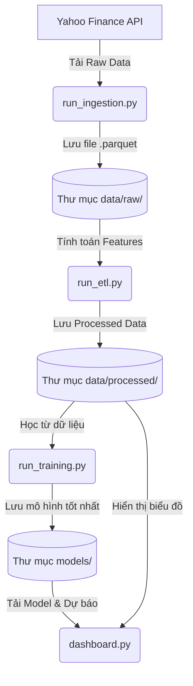

# Hướng Dẫn Chi Tiết Hệ Thống Dự Báo Chứng Khoán (Stock Prediction System)

Chào mừng bạn đến với tài liệu hướng dẫn chi tiết về hệ thống dự báo giá chứng khoán. Đây là một hệ thống end-to-end bao gồm từ bước thu thập dữ liệu, xử lý đặc trưng, huấn luyện mô hình học máy cho đến hiển thị kết quả trên Dashboard.

---

## 1. Tổng Quan Hệ Thống

Hệ thống được thiết kế theo kiến trúc **Pipeline Layered**, chia làm 4 giai đoạn chính:
1.  **Ingestion (Thu thập)**: Lấy dữ liệu lịch sử từ Yahoo Finance.
2.  **ETL (Xử lý)**: Làm sạch dữ liệu và tạo ra các chỉ số kỹ thuật (Features Engineering).
3.  **Training (Huấn luyện)**: Dùng các thuật toán Machine Learning để học từ dữ liệu quá khứ.
4.  **Dashboard (Hiển thị)**: Giao diện tương tác người dùng để xem dự báo và phân tích.

---

## 2. Cấu Trúc Thư Mục & Vai Trò Từng File

### 📂 Thư mục gốc (Root)
*   `run_ingestion.py`: File thực thi chính để tải dữ liệu.
*   `run_etl.py`: File thực thi chính để xử lý dữ liệu và tạo tập Train/Test.
*   `run_training.py`: File thực thi chính để huấn luyện các mô hình ML.
*   `requirements.txt`: Danh sách các thư viện cần cài đặt (pandas, sklearn, yfinance, streamlit...).

### 📂 ingestion/ (Tầng Thu thập)
*   `data_ingestion.py`: Chứa class `StockDataIngestion`. Nhiệm vụ là kết nối với thư viện `yfinance`, thực hiện tải dữ liệu theo danh sách các mã chứng khoán (tickers) và lưu thành file Parquet.

### 📂 etl/ (Tầng Xử lý dữ liệu)
*   `etl_pipeline.py`: Trái tim của quá trình biến đổi dữ liệu.
    *   Tính toán **Moving Averages (MA)**: MA10, MA20, MA50.
    *   Tính toán **Lag Features**: Giá trị của 1, 5, 10 ngày trước.
    *   Tính toán chỉ số sức mạnh tương đối **RSI**.
    *   Tính toán **Volatility** (Độ biến động).
    *   Thực hiện **Standard Scaling** (Chuẩn hóa dữ liệu) để mô hình học tốt hơn.

### 📂 model/ (Tầng Mô hình)
*   `model_training.py`: Triển khai các thuật toán:
    *   **Linear Regression**: Mô hình cơ bản nhất.
    *   **Random Forest**: Mô hình cây quyết định mạnh mẽ.
    *   **Gradient Boosting**: Mô hình tối ưu hóa lỗi.
    *   Hệ thống sẽ tự động so sánh RMSE (sai số) để chọn ra **Best Model** lưu vào thư mục `models/`.

### 📂 dashboard/ (Tầng Hiển thị)
*   `dashboard.py`: Sử dụng **Streamlit**. Giao diện này không chỉ hiển thị biểu đồ mà còn tích hợp bộ não AI để đưa ra khuyến nghị thực tế:
    *   **Price Analysis**: Biểu đồ nến và đường trung bình động (MA).
    *   **AI Recommendations**: Tự động phân loại mức độ khuyến nghị (Strong Buy -> Strong Sell) dựa trên tỷ lệ lợi nhuận dự báo.
    *   **Technical Indicators**: Trực quan hóa RSI và Volatility để người dùng có cái nhìn đa chiều.
    *   **Multi-Stock Comparison**: So sánh hiệu suất của nhiều mã cổ phiếu cùng lúc bằng cách chuẩn hóa giá về mốc 100.

### 📂 configs/ (Cấu hình)
*   `config.yaml`: Nơi thay đổi cấu hình mà không cần sửa code (Danh sách mã chứng khoán, số năm dữ liệu, các tham số kỹ thuật).
*   `config.py`: Đọc file YAML và chuyển thành đối tượng trong Python (Hỗ trợ chuyển đổi đường dẫn linh hoạt giữa môi trường Local và Databricks).

---

## 3. Giải Thích Các Thành Phần Quan Trọng

### 3.1. Feature Engineering (Trong `etl_pipeline.py`)
Tại sao cần các chỉ sổ này?
-   **MA (Moving Average)**: Giúp mô hình biết xu hướng ngắn hạn và dài hạn. Nếu giá nằm trên MA, xu hướng thường là tăng.
-   **Lag Features**: Cung cấp "trí nhớ" cho mô hình. Ví dụ: Giá hôm qua có ảnh hưởng lớn đến giá hôm nay.
-   **RSI (Relative Strength Index)**: Đo lường tốc độ và sự thay đổi của biến động giá để xác định tình trạng quá mua hoặc quá bán.
-   **Volatility**: Độ biến động. Giúp mô hình hiểu được mức độ rủi ro hiện tại của thị trường.

### 3.2. Logic Khuyến Nghị AI (Trong `dashboard.py`)
Hệ thống sử dụng một bộ quy tắc dựa trên `Predicted Return` (Lợi nhuận dự báo) cho ngày kế tiếp:
*   **🟢 STRONG BUY**: Lợi nhuận dự báo > 1%.
*   **🟡 HOLD / BUY**: Lợi nhuận dự báo từ 0% đến 1%.
*   **🟠 HOLD / SELL**: Lợi nhuận dự báo giảm nhẹ (từ -1% đến 0%).
*   **🔴 STRONG SELL**: Lợi nhuận dự báo giảm mạnh (> 1%).

**Đặc biệt:** Hệ thống tự động tính toán ngày giao dịch tiếp theo (Next Business Day), tự động bỏ qua các ngày Thứ 7 và Chủ Nhật để đảm bảo tính thực tế.

### 3.3. Quy Trình Huấn Luyện (Trong `run_training.py`)
Mô hình không chỉ chạy một lần. Nó thực hiện:
1.  **Split Data**: Chia dữ liệu theo thời gian (Time-series split) để tránh dự báo dựa trên dữ liệu tương lai.
2.  **Model Comparison**: Chạy song song nhiều thuật toán (Linear, Random Forest, Gradient Boosting).
3.  **Best Model Selection**: Tự động chọn mô hình có sai số thấp nhất (RMSE thấp nhất) để đưa vào sử dụng thực tế.

---

## 4. Luồng Dữ Liệu (Data Flow)
Dữ liệu di chuyển qua hệ thống theo đường ống một chiều để đảm bảo tính nhất quán:



---

## 5. Cách Vận Hành

Để chạy toàn bộ hệ thống, bạn thực hiện theo các bước sau trong Terminal:

1.  **Cài đặt môi trường:**
    ```bash
    pip install -r requirements.txt
    ```

2.  **Bước 1 - Tải dữ liệu:**
    ```bash
    python run_ingestion.py
    ```

3.  **Bước 2 - Tiền xử lý & Tạo đặc trưng:**
    ```bash
    python run_etl.py
    ```

4.  **Bước 3 - Huấn luyện mô hình:**
    ```bash
    python run_training.py
    ```

5.  **Bước 4 - Mở giao diện Dashboard:**
    ```bash
    streamlit run dashboard/dashboard.py
    ```

---

## 6. Các Điểm Kỹ Thuật Cần Lưu Ý
*   **Standardization**: Các feature được chuẩn hóa về cùng một thang đo (Z-score) giúp các thuật toán như Linear Regression không bị thiên kiến bởi các con số quá lớn.
*   **Target Return**: Thay vì dự báo giá tuyệt đối (ví dụ $150), hệ thống dự báo **tỷ lệ thay đổi** (ví dụ +1.2%). Điều này giúp mô hình ổn định hơn với những cổ phiếu có mức giá khác nhau.
*   **Business Logic**: Hệ thống được thiết kế để có thể mở rộng. Bạn có thể thêm các mã chứng khoán (Tickers) mới vào `config.yaml` và hệ thống sẽ tự động thực hiện lại toàn bộ quy trình cho mã đó.
